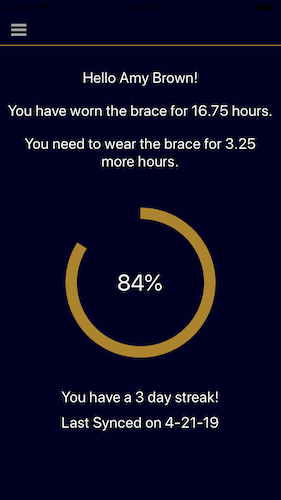
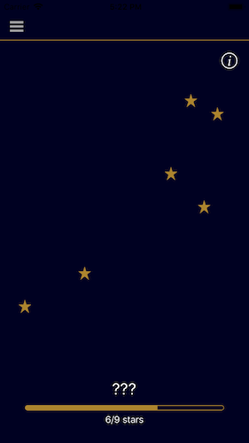
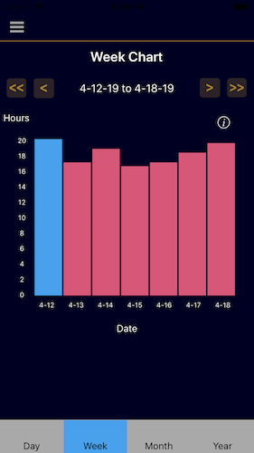

<h3 className="major">Background</h3>

In my last year of undergrad, my Senior Design project was to implement a real time solution to scoliosis brace compliance tracking.

Patients with scoliosis are prescribed to wear a brace for a set number of hours a day. However, this treatment fails if patients do not comply. With current sensors, doctors read compliance data once every 3 months. In contrast, Stellar Spine provides real-time data to encourage patients to comply with brace treatment.

<h3 className="major">Solution</h3>

|                       Home Screen                        |                       Constellations                        |                       Weekly Compliance                        |
| :------------------------------------------------------: | :---------------------------------------------------------: | :------------------------------------------------------------: |
|  |  |  |

<table>
<tr>
<th>Home Screen</th>
<th>Constellations</th>
<th>Weekly Compliance</th>
</tr>
<tr>
<td>

</td>
<td>

</td>
<td>

</td>
</tr>
<table>
